# MazeBot_Projet - Navigation du Robot dans le labyrinthe de maniere autonome avec CoppeliaSim

# MazeBot_Projet

## Description

MazeBot simule un robot mobile à roues différentielles (Pioneer P3DX) évoluant dans un labyrinthe 3D construit sous **CoppeliaSim**. Le robot dispose de capteurs de proximité ultrasoniques simulés (avant, gauche, droite) pour détecter les murs et naviguer de manière autonome.

L'algorithme de navigation implémenté est le **Wall-Following** (longe le mur gauche ou droit) avec un système avancé de mémoire spatiale et de détection de répétition de trajectoire. La vitesse des roues est commandée en temps réel selon les lectures des capteurs. Un chronomètre mesure le temps de résolution et un tracé de trajectoire est affiché à l'écran.

## Membres du groupe

| Nom                | Rôle                                                                                                          |
| ------------------ | ------------------------------------------------------------------------------------------------------------- |
| Jean Lesly JOCELYN | Développeur principal - Algorithmes de navigation (Wall-Following), mémoire spatiale, anti-répétition         |
| Schnaider Marc     | Développeur assistant - Implémentation des capteurs, commande des moteurs, tests unitaires                    |
| Amilca Pierre Anse | Intégrateur 3D - Construction du labyrinthe, configuration des marqueurs (départ/arrivée), réglages physiques |
| Jean Lesly JOCELYN | Responsable documentation - Rédaction du README, captures d'écran, vidéo de démonstration                     |

## Lien GitHub

[https://github.com/Lesly0116/MazeBot_Projet](https://github.com/Lesly0116/MazeBot_Projet)

## Capture / Vidéo de la simulation

### Vidéo de démonstration


Vidéo montrant le robot Pioneer P3DX naviguant de l'entrée à la sortie du labyrinthe avec l'algorithme Wall-Following

[Télécharger la vidéo](videos/MazeBot_Simulation.mp4) (cliquez pour visionner)

### Captures d'écran

#### 1. Vue générale de la scène

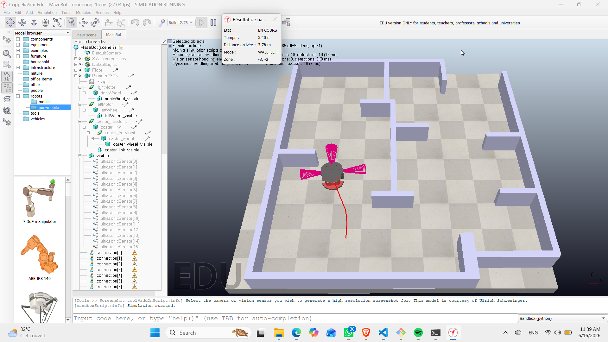
_Point de départ du robot avec le tableau UI (temps: 5.40s, distance: 3.78m)_

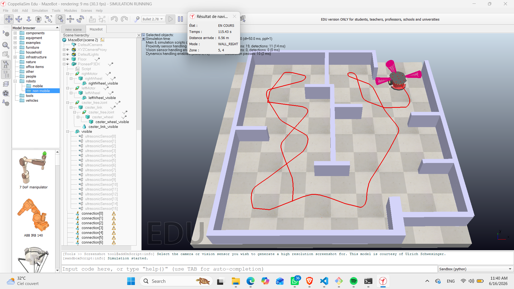
_Zone d'arrivée du robot_

---

#### 2. Navigation et détection d'obstacles

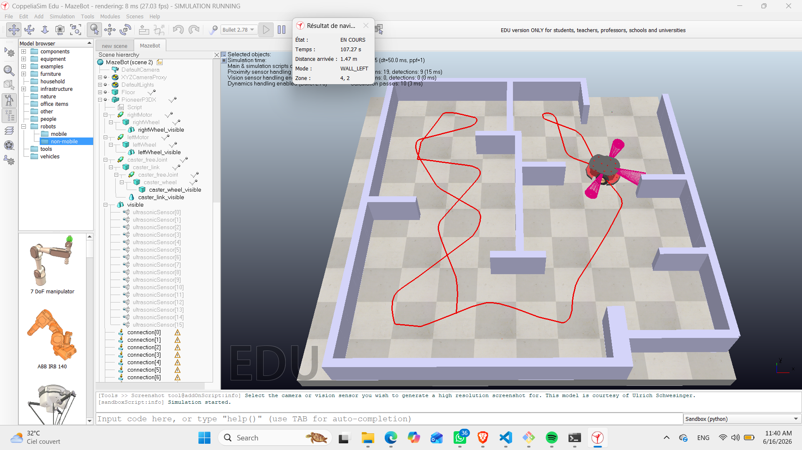
_Détection d'un obstacle en approche d'un coin_

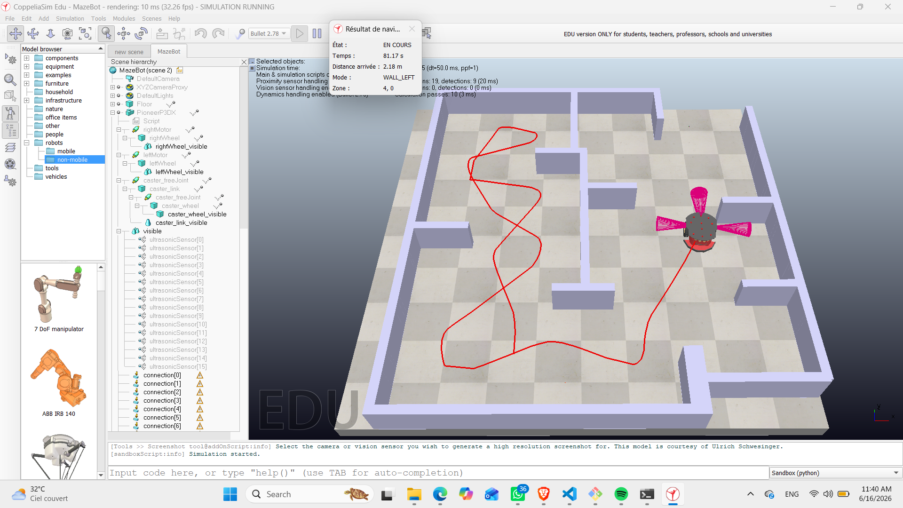
_Le robot contourne un obstacle_

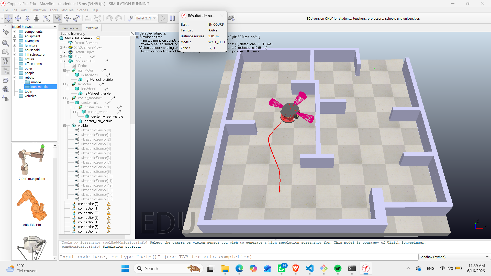
_Robot en progression avec tableau UI (temps: 9.66s, distance: 3.01m)_

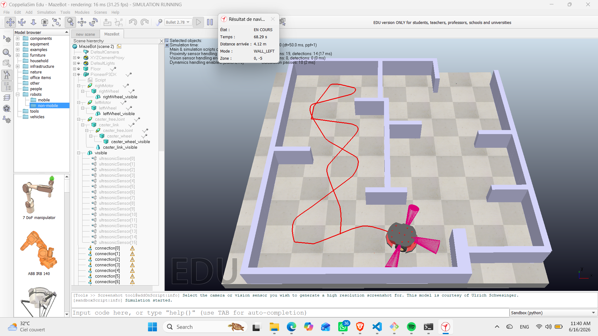
_Choix d'un autre chemin à une intersection_

---

#### 3. Gestion des obstacles et coins

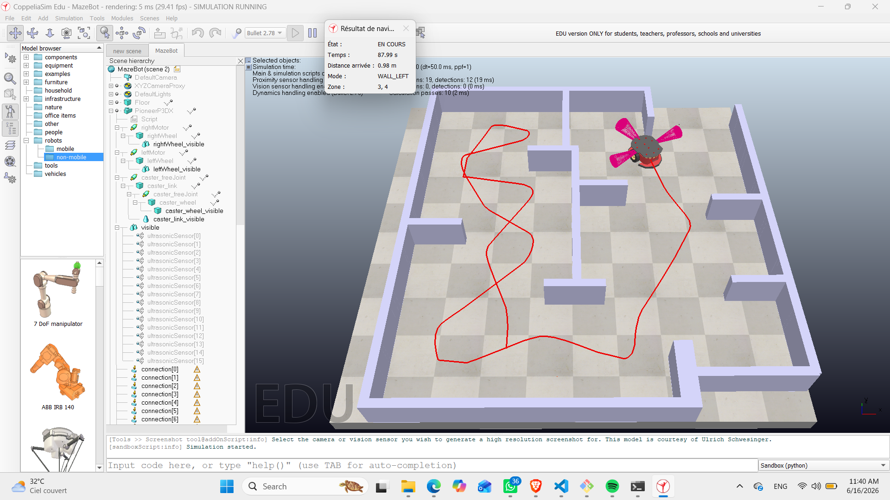
_Gestion d'un obstacle en coin_

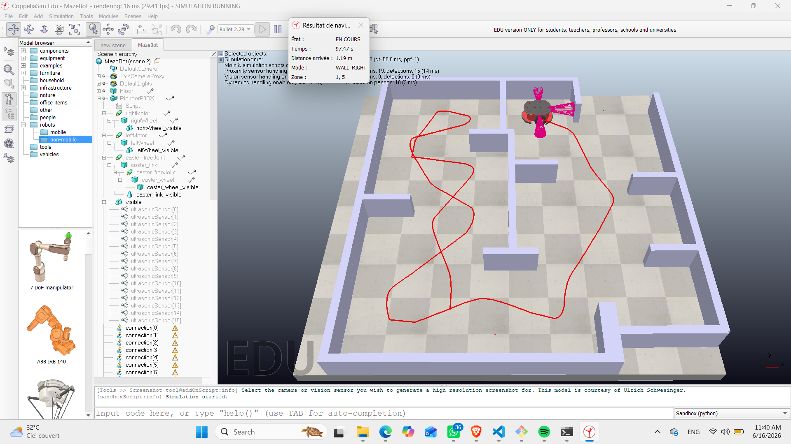
_Détection d'une autre direction possible_

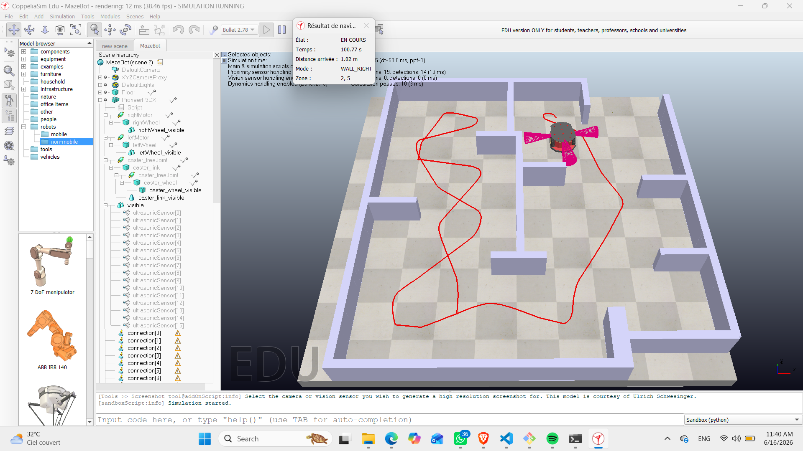
_Sortie après avoir contourné un obstacle en coin_

---

#### 4. Autres comportements

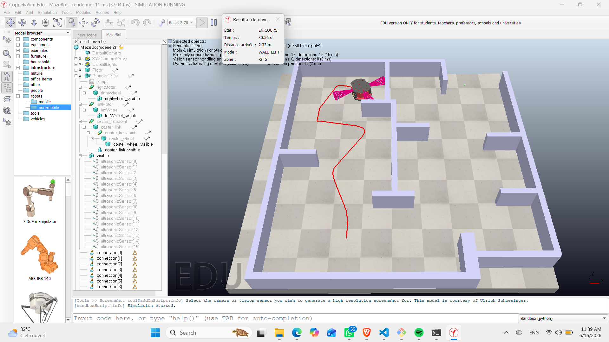
_Manoeuvre de demi-tour en impasse_

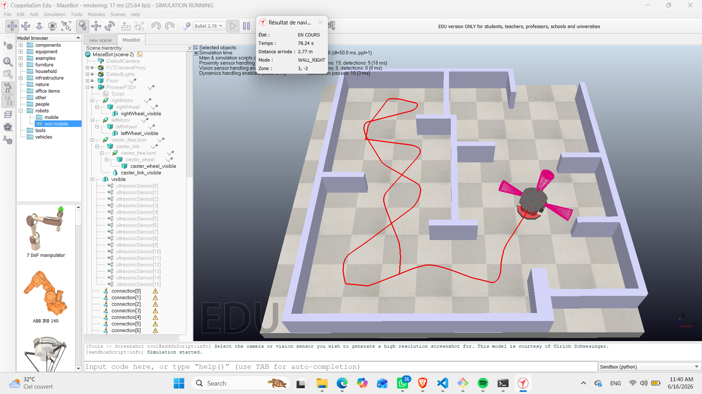
_Détection d'obstacle supplémentaire_

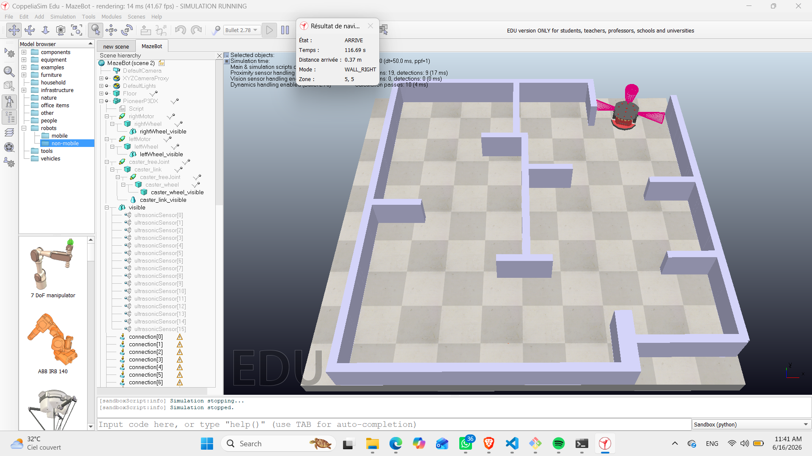
_Nettoyage de la trajectoire après arrivée_

## Composants / Modèles 3D utilisés

| Composant          | Modèle          | Source                                 | Description                                        |
| ------------------ | --------------- | -------------------------------------- | -------------------------------------------------- |
| Robot              | Pioneer P3DX    | `Models/robots/mobile/PioneerP3DX.ttm` | Robot mobile à roues différentielles               |
| Moteurs gauche     | `leftMotor`     | Modèle Pioneer P3DX                    | Commande vitesse roue gauche                       |
| Moteurs droit      | `rightMotor`    | Modèle Pioneer P3DX                    | Commande vitesse roue droite                       |
| Capteur avant      | `sensor_avant`  | `Add/Proximity Sensor/Cone Type`       | Détection obstacles devant                         |
| Capteur gauche     | `sensor_gauche` | `Add/Proximity Sensor/Cone Type`       | Détection obstacles à gauche                       |
| Capteur droite     | `sensor_droite` | `Add/Proximity Sensor/Cone Type`       | Détection obstacles à droite                       |
| Zone d'arrivée     | `Arrivee`       | `Add/Dummy`                            | Point d'arrivée du robot (invisible en simulation) |
| Zone de départ     | `Depart`        | `Add/Dummy`                            | Point de départ du robot (invisible en simulation) |
| Murs du labyrinthe | `Cuboid`        | `Add/Primitive shape/Cuboid`           | Obstacles formant le labyrinthe                    |

## Répartition du travail

| Tâche                                             | Responsable        |
| ------------------------------------------------- | ------------------ |
| Conception et architecture du projet              | Jean Lesly JOCELYN |
| Construction de la scène 3D (labyrinthe, murs)    | Amilca Pierre Anse |
| Configuration des marqueurs (départ/arrivée)      | Amilca Pierre Anse |
| Implémentation de l'algorithme Wall-Following     | Jean Lesly JOCELYN |
| Implémentation du système de mémoire spatiale     | Jean Lesly JOCELYN |
| Détection et correction des trajectoires répétées | Jean Lesly JOCELYN |
| Intégration des capteurs ultrasoniques            | Schnaider Marc     |
| Commande des moteurs et asservissement            | Schnaider Marc     |
| Tests, débogage et validation                     | Amilca Pierre Anse |
| Réglages des paramètres (vitesse, distances)      | Schnaider Marc     |
| Rédaction du README                               | Jean Lesly JOCELYN |
| Captures d'écran et vidéo de démonstration        | Jean Lesly JOCELYN |
| Documentation technique du projet                 | Jean Lesly JOCELYN |

## Tests réalisés

| Test                  | Objectif                                          | Résultat                          |
| --------------------- | ------------------------------------------------- | --------------------------------- |
| Suivi de mur gauche   | Vérifier que le robot longe correctement les murs | Validé                            |
| Suivi de mur droit    | Vérifier le changement de stratégie               | Validé                            |
| Détection d'impasse   | Robot doit faire demi-tour                        | Reste a ameliorer mais fonctionne |
| Anti-répétition       | Ne pas tourner en boucle dans un couloir          | Validé                            |
| Arrivée à destination | S'arrête quand distance < 0.40m                   | Validé                            |
| Affichage tableau UI  | Mise à jour temps/distance/zone                   | Validé                            |
| Trajectoire rouge     | Tracé continu du parcours                         | Validé                            |

## Améliorations possibles

1. Augmentation de la vitesse du robot.
2. Demi-tour beaucoup plus fluide quand le robot rencontre un obstacle qui l'empeche d'avancer.

## Difficultés rencontrées

1. **Effondrement des murs** : Au lancement, les cuboïdes s'effondraient à cause des paramètres physiques par défaut. Solution : augmenter la masse des murs et activer le paramètre "Body is respondable" dans les propriétés de CoppeliaSim.

2. **Répétition en boucle** : Le robot tournait en rond dans certains chemins. Correction via un système de mémoire spatiale qui détecte les zones déjà visitées et force un changement de stratégie (alternance suivi gauche/droit).

3. **Blocage contre un mur (cas rare)** : Parfois, le robot reste coincé face à un mur et continue d'avancer sans reculer. Une correction a été apportée (seuil de sécurité à 0,15 m + recul automatique), mais le problème peut encore survenir occasionnellement dans des configurations très serrées. Une amélioration future serait d'ajouter un timer de détection de non-progression pour forcer un recul systématique.

## Installation

### Prérequis

- **CoppeliaSim** (version Edu ) avec support ZMQ Remote API
- **Python 3.7+**
- **Git**

### Cloner le dépôt

```bash
git clone https://github.com/Lesly0116/MazeBot_Projet.git
cd MazeBot_Projet
```
